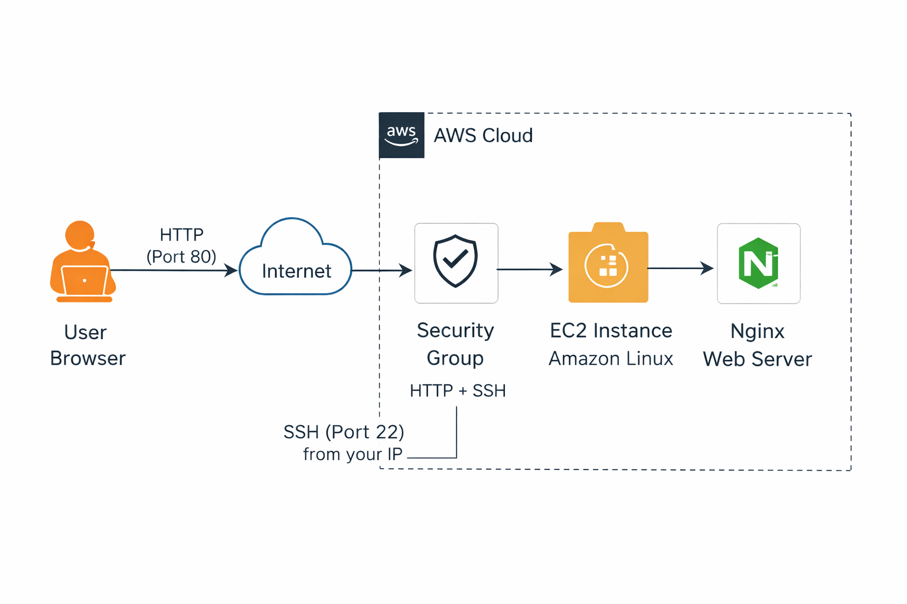
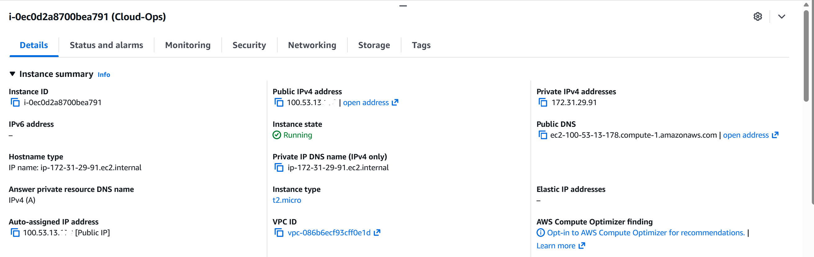
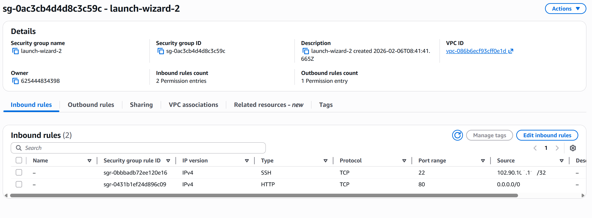
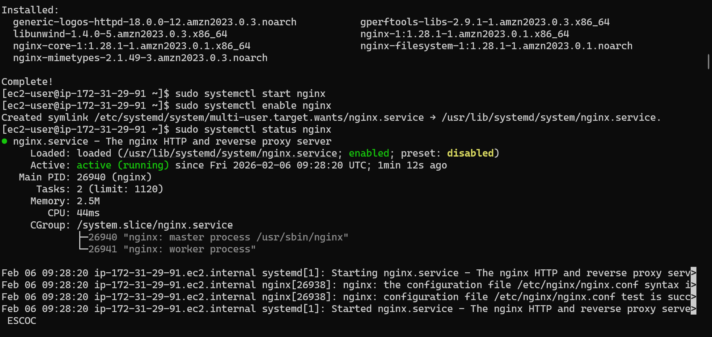

# aws-ec2-nginx-manual-to-automated

## Project Overview
This project demonstrates the transition from **manual Linux server provisioning** to **automated infrastructure bootstrapping** on AWS EC2.

It begins with setting up an EC2 instance and installing Nginx manually via SSH, then progresses to automating the same setup using **EC2 user-data and Bash scripting**.  
The goal is to showcase **repeatability, automation, and operational thinking**, not just getting a web server running.

---

## Architecture Summary

**Core Components**
- Amazon EC2 (Compute)
- Amazon Linux AMI
- Security Groups (SSH + HTTP)
- Nginx Web Server
- Bash scripting (EC2 user-data)

**Flow**
1. Launch EC2 instance
2. Configure network access (SSH / HTTP)
3. Manual server provisioning
4. Automated provisioning using user-data
5. Validate service availability

6. ## Architecture Diagram

---

## Phase 1: Manual EC2 Provisioning

### EC2 Instance Setup
- AMI: Amazon Linux
- Instance Type: t2.micro
- 

- Security Group Rules:
  - SSH (22) – restricted to my IP
  - HTTP (80) – open for web access
  - 

### SSH Access
- Connected securely to the instance using SSH
- Verified OS and instance identity
- 

### Manual Nginx Installation
- Installed Nginx using the system package manager
- Started and enabled the service
- Verified service status using `systemctl`
- 

### Manual Validation
- Accessed the public IP via browser
- Confirmed Nginx default page loads successfully
- 

---

## Phase 2: Automated Provisioning Using EC2 User-Data

### Automation Strategy
To eliminate manual steps, a **Bash user-data script** was provided at instance launch to:
- Update the system
- Install Nginx
- Start and enable the web service automatically
- 

This ensures the server is fully configured **immediately after boot**.

### Automated EC2 Launch
- New EC2 instance launched using the same AMI and security group
- No SSH required for initial setup
-  

### Automated Validation
- Nginx web page accessible via browser immediately after instance startup
- Confirms successful automation and repeatability
- 

---

## Key Engineering Lessons
- Manual provisioning does not scale
- Automation improves consistency and speed
- EC2 user-data is a foundational automation mechanism
- Bash scripting remains a critical cloud skill
- Infrastructure should be reproducible, not manually rebuilt

---

## Security Notes
- SSH access restricted to a single IP
- Public IPs partially masked in screenshots
- No credentials or secrets committed to this repository

---

## Future Improvements
- Infrastructure provisioning using Terraform
- Load Balancer and Auto Scaling integration
- CloudWatch monitoring and logging
- CI/CD pipeline for deployment automation

---

## Author
**Chisom Eze**  
Cloud Ops/Solutions Architect  
Focus: AWS • Linux • Infrastructure Automation 
